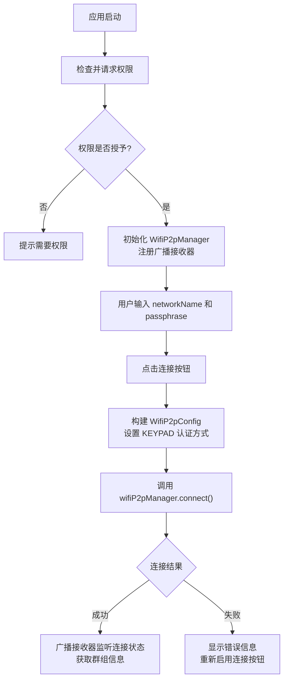

# GroupConnect

一个基于 **WiFi Direct（Wi-Fi P2P）** 的 Android 客户端应用，核心功能是通过指定的 `networkName`（网络名称）和 `passphrase`（密码）连接到 WiFi Direct Group（P2P 热点）。

## 项目概述

GroupConnect 实现了一个轻量级的 WiFi Direct 客户端 Demo，用户只需输入 Direct 热点的网络名称和密码，即可快速连接到已创建的 P2P Group。该应用利用 Android `WifiP2pConfig.Builder` API（Android Q / API 29+）和 `WpsInfo.KEYPAD` 认证方式，实现了**无需设备发现、无需 Group Owner 手动确认**的直连模式。

## 技术架构

### 项目结构

```
app/src/main/
├── java/com/example/groupconnect/
│   ├── MainActivity.kt                  # 主界面，处理用户输入与连接逻辑
│   └── WiFiDirectBroadcastReceiver.kt   # 广播接收器，监听 WiFi Direct 状态变化
├── res/
│   ├── layout/
│   │   ├── activity_main.xml            # 主界面布局
│   │   └── device_item.xml             # 设备列表项布局
│   └── values/
│       ├── strings.xml                  # 字符串资源
│       ├── colors.xml                   # 颜色资源
│       └── themes.xml                   # 主题配置
└── AndroidManifest.xml                  # 应用配置与权限声明
```

### 核心流程



### 核心组件

#### 1. MainActivity

- **权限管理**：使用 `ActivityResultContracts.RequestMultiplePermissions` 动态请求所需权限
- **WiFi P2P 初始化**：获取 `WifiP2pManager` 系统服务，初始化 `Channel` 通道
- **连接逻辑**：通过 `WifiP2pConfig.Builder` 构建连接配置，使用 `WpsInfo.KEYPAD` 方式进行 PSK 密码认证，调用 `wifiP2pManager.connect()` 发起连接

#### 2. WiFiDirectBroadcastReceiver

监听以下 WiFi Direct 广播事件：

| 广播事件 | 说明 |
|---|---|
| `WIFI_P2P_STATE_CHANGED_ACTION` | WiFi Direct 功能启用/禁用状态变化 |
| `WIFI_P2P_PEERS_CHANGED_ACTION` | 对等设备列表更新 |
| `WIFI_P2P_CONNECTION_CHANGED_ACTION` | 连接状态变化，获取群组信息 |
| `WIFI_P2P_THIS_DEVICE_CHANGED_ACTION` | 本机设备信息变化 |

### 连接原理

应用采用 **WPA2-PSK（预共享密钥）** 认证模式连接到 WiFi Direct Group：

1. Group Owner 端使用 `WifiP2pConfig.Builder` 指定 `networkName` 和 `passphrase` 创建 Autonomous Group
2. 客户端（本应用）使用相同的 `networkName` 和 `passphrase`，配合 `WpsInfo.KEYPAD` 方式发起连接
3. 密码匹配即可加入群组，**无需 Group Owner 端弹出确认对话框**

这等同于连接一个已知密码的 WiFi 热点，密码本身就是认证凭证。

## 环境要求

| 项目 | 要求 |
|---|---|
| **最低 SDK 版本** | API 24（Android 7.0） |
| **目标 SDK 版本** | API 32（Android 12L） |
| **编译 SDK 版本** | API 36 |
| **开发语言** | Kotlin |
| **JDK 版本** | Java 11 |
| **构建工具** | Gradle（AGP 9.1.0） |

## 所需权限

```xml
<uses-permission android:name="android.permission.ACCESS_WIFI_STATE" />
<uses-permission android:name="android.permission.CHANGE_WIFI_STATE" />
<uses-permission android:name="android.permission.ACCESS_FINE_LOCATION" />
<uses-permission android:name="android.permission.ACCESS_COARSE_LOCATION" />
<uses-permission android:name="android.permission.NEARBY_WIFI_DEVICES" />
```

## 使用方式

1. 确保设备支持 WiFi Direct 功能
2. 安装并启动应用，授予所需权限
3. 输入 Direct 热点的**网络名称**（如 `DIRECT-123`）
4. 输入 Direct 热点的**密码**（如 `00000000`）
5. 点击「连接Direct热点」按钮
6. 连接状态会实时显示在界面下方

## 主要依赖

- `androidx.core:core-ktx` - AndroidX Core KTX 扩展
- `androidx.appcompat:appcompat` - AppCompat 兼容库
- `com.google.android.material:material` - Material Design 组件库
