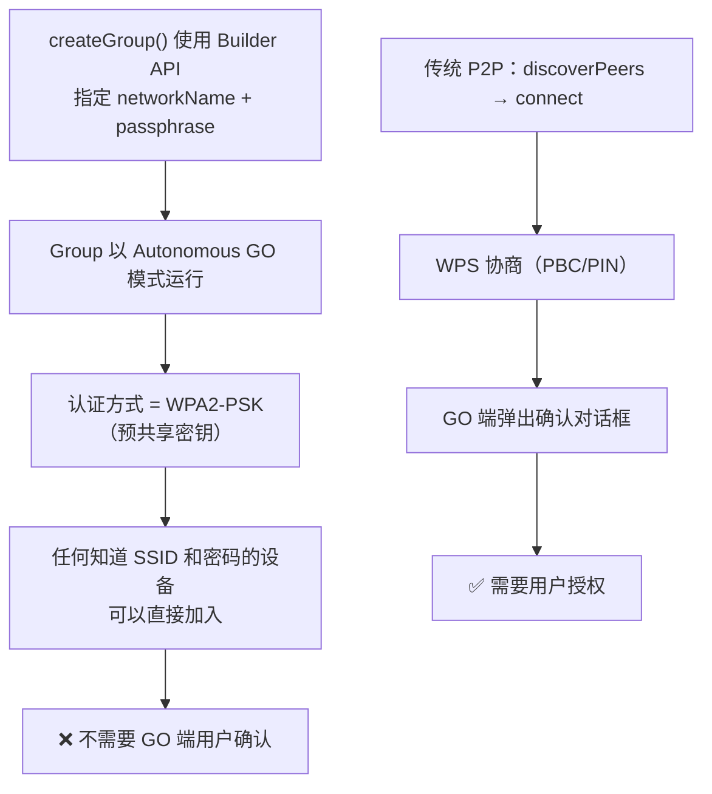

[任务规划完成]
我已经阅读了 `request.md` 的内容。用户想知道为什么当前的 WiFi P2P 连接方式不需要通过认证即可连接上 group。让我先查看项目中的连接逻辑来进行完整分析。
[读取文件]
现在我已经掌握了完整的代码信息，可以给出分析了。

## 分析：为什么客户端连接 P2P Group 不需要通过认证

### 核心原因

这是因为 **创建 Group 时使用了 `WifiP2pConfig.Builder` API，并且在 `config` 中直接指定了 `networkName` 和 `passphrase`**，这使得 Group 本质上变成了一个 **自治的（Autonomous）WiFi Direct Group Owner**。客户端在连接时，只要提供正确的 `networkName` + `passphrase`，就能直接加入，**无需 Group Owner 端进行交互式的用户确认/授权**。

### 详细分析

#### 1. 创建端（Group Owner）的行为

```kotlin
val config = WifiP2pConfig.Builder()
    .setNetworkName("DIRECT-123")
    .setPassphrase("00000000")
    .build()

wifiP2pManager.createGroup(channel, config, listener)
```

使用 `WifiP2pConfig.Builder`（Android Q / API 29+ 引入）创建 Group 时：

- **指定了固定的 `networkName`（SSID）和 `passphrase`（密码）**，这意味着 Group 的认证方式是 **WPA2-PSK（Pre-Shared Key，预共享密钥）**
- 这类似于创建了一个 **WiFi 热点**，任何知道 SSID 和密码的设备都可以直接连接
- **不需要** Group Owner 端弹出对话框让用户手动确认"是否允许 XX 设备加入"

#### 2. 连接端（Client）的行为

在 [MainActivity.kt](/Users/junjiecui/AndroidStudioProjects/GroupConnect/app/src/main/java/com/example/groupconnect/MainActivity.kt) 中的 `connectToGroup()` 方法：

```kotlin
val config = WifiP2pConfig.Builder()
    .setDeviceAddress(device_address)
    .setNetworkName(networkName)
    .setPassphrase(passphrase)
    .build()

config.wps.setup = WpsInfo.KEYPAD

wifiP2pManager.connect(channel, config, ...)
```

客户端通过提供：
- `networkName` = Group 的 SSID（如 `"DIRECT-123"`）
- `passphrase` = Group 的密码（如 `"00000000"`）
- `WpsInfo.KEYPAD` = 告知框架使用密码（KEYPAD）方式进行 WPS 认证

就可以直接连接，**密码本身就是"认证凭证"**。

#### 3. 对比：传统 WiFi P2P 连接需要认证的场景

在传统 WiFi P2P（不使用 Builder API）连接场景中：

| 特征 | 传统 P2P 连接 | 当前项目使用的方式 |
|---|---|---|
| **发现方式** | `discoverPeers()` → 选择设备 → `connect()` | 直接通过 `networkName` + `passphrase` 连接 |
| **WPS 方式** | 通常 `WpsInfo.PBC`（按钮确认） | `WpsInfo.KEYPAD`（密码认证） |
| **用户交互** | GO 端需要弹出确认对话框 | GO 端无需确认 |
| **认证机制** | 双方协商 + 用户确认 | PSK 密码匹配即可 |
| **类比** | 类似蓝牙配对弹窗 | 类似连接 WiFi 热点输入密码 |

#### 4. 根本原因总结



**简而言之**：当 `createGroup()` 使用 `WifiP2pConfig.Builder` 显式指定了 `networkName` 和 `passphrase` 时，Group 实质上以 **自治 Group Owner（Autonomous GO）** 模式运行，其认证模型等同于普通 WiFi 热点 —— **密码即凭证，匹配则允许加入**，无需 Group Owner 端的人工审批。这就是为什么客户端仅凭正确的网络名称和密码就能"免认证"连接上 Group 的原因。